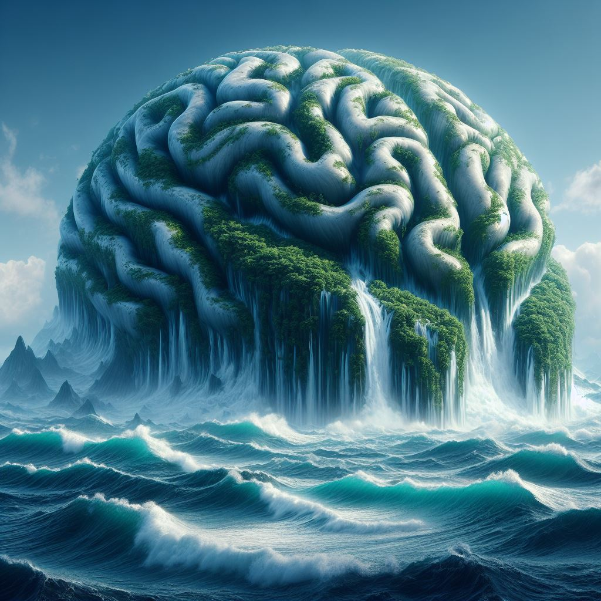

  

# BrainWave
BrainWave is an innovative flashcard system designed to supercharge your learning experience. Seamlessly blending neuroscience principles with cutting-edge technology, BrainWave optimizes memory retention and comprehension. With customizable decks and interactive quizzes, you can tailor your study sessions to your unique learning style. Whether you're studying for exams, learning a new language, or mastering a skill, BrainWave empowers you to unlock your full learning potential. Say goodbye to traditional rote memorization and hello to efficient, effective learning with BrainWave.

# 
This is enhance a flashcard system using deep learning is by incorporating natural language processing (NLP) techniques to automatically generate flashcards from text-based learning materials. Here's an idea of how it could work:

**Text Analysis:** Utilize NLP algorithms to analyze textbooks, articles, or lecture notes and extract key concepts, definitions, and important information.

**Content Summarization:** Use summarization techniques to condense lengthy text into concise flashcard prompts, ensuring that users focus on the most essential information.

**Question Generation:** Employ deep learning models to generate quiz questions based on the extracted content. This could involve generating fill-in-the-blank questions, multiple-choice questions, or short-answer questions.

**Adaptive Learning:** Implement machine learning algorithms to track user performance and adaptively adjust the difficulty level and content of flashcards based on individual learning progress. For example, the system could prioritize flashcards on topics that the user struggles with or introduce new concepts gradually as mastery is achieved.

**Feedback Mechanism:** Incorporate sentiment analysis to gather user feedback on flashcards, such as difficulty level or relevance, and use this information to continuously refine and improve the flashcard generation process.

By integrating these deep learning technologies into a flashcard system, we can create a more personalized, efficient, and effective learning experience for users, helping them master new concepts and retain information more effectively.

